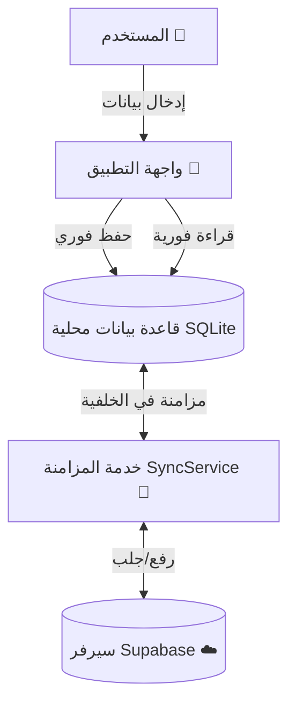

# تدفق البيانات والمزامنة في مشروع "مصاريف الشباب"

بناءً على طلبك، إليك شرح تفصيلي لكيفية عمل النظام لحفظ وجلب البيانات.

## هل هناك مهلة (Delay)؟
**الإجابة باختصار**:
- **عند فتح التطبيق**: **لا**. البيانات تظهر فوراً لأنها مخزنة محلياً على جهازك.
- **بعد التسجيل/تسجيل الدخول**: نعم، مهلة قصيرة جداً (ثوانٍ) لنقل بياناتك من "وضع الزائر" إلى حسابك الجديد ومزامنتها. تظهر لك كشاشة تحميل.
- **أثناء الاستخدام العادي**: **لا**. الحفظ يتم محلياً فوراً، والمزامنة مع السيرفر تتم في الخلفية دون أن تشعر.

---

## 1. هيكلية البيانات (Offline-First Architecture)

التطبيق لا يعتمد على الإنترنت بشكل مباشر لعرض البيانات. بدلاً من ذلك، يستخدم قاعدة بيانات محلية كـ "المصدر الأول للحقيقة" للواجهة.

---

## 2. تفاصيل العمليات

### أ. عملية حفظ البيانات (عند إضافة نفقة جديدة)
1. **الحفظ المحلي (فوري)**: بمجرد ضغط "حفظ"، يتم تخزين البيانات في ملف `SQLite` داخل هاتفك.
2. **تحديث الواجهة**: الشاشة تتحدث فوراً لتظهر النفقة الجديدة.
3. **المزامنة (في الخلفية)**:
   - خدمة المزامنة `SyncService` تتحقق من الإنترنت.
   - إذا كنت متصلاً: ترسل البيانات للسيرفر (`Supabase`) وتضع علامة "تمت المزامنة".
   - إذا كنت غير متصل: تبقى البيانات بعلامة "غير متزامن" (`isSynced = false`) حتى تتصل بالإنترنت لاحقاً.

### ب. عملية جلب البيانات (عند فتح التطبيق)
1. **قراءة المحلية**: التطبيق يقرأ البيانات من الهاتف ويعرضها فوراً (سريع جداً).
2. **التحقق من السيرفر**: في الخلفية، التطبيق يسأل السيرفر: "هل هناك بيانات جديدة؟".
3. **التحديث الصامت**: إذا وجدت بيانات جديدة (مثلاً أضفتها من هاتف آخر)، يتم تحميلها وحفظها محلياً، ثم تتحدث الشاشة تلقائياً.

### ج. عملية التسجيل (نقل البيانات)
هذه هي الحالة الوحيدة التي قد تشعر فيها بمهلة بسيطة:
1. كنت تستخدم التطبيق كـ **زائر** (بياناتك مرتبطة بـ `guest_id`).
2. قررت **تسجيل حساب** جديد.
3. التطبيق يقوم بالتالي:
   - ينشئ الحساب في السيرفر.
   - يأخذ كل نفقاتك القديمة ويغير معرفها لتصبح تابعة للحساب الجديد (`migrateGuestData`).
   - يرفع هذه البيانات للسيرفر.
4. بمجرد الانتهاء، يدخلك للشاشة الرئيسية.

---

## 3. الكود المسؤول (Technical Deep Dive)

- **`LocalStorageService.dart`**: المسؤول عن التعامل مع ملف قاعدة البيانات على الهاتف. يستخدم `sqflite`.
- **`SyncService.dart`**: "المايسترو" الذي يعمل في الخلفية. يحتوي على دالة `syncAll()` التي ترفع البيانات الجديدة وتجلب التحديثات.
- **`AuthService.dart`**: يدير التسجيل ويستدعي دالة نقل البيانات `migrateGuestData` عند نجاح التسجيل.

هذا التصميم يضمن أن التطبيق **سريع جداً** ويعمل **بدون إنترنت**، وهي الممارسة الأفضل للتطبيقات الحديثة.
