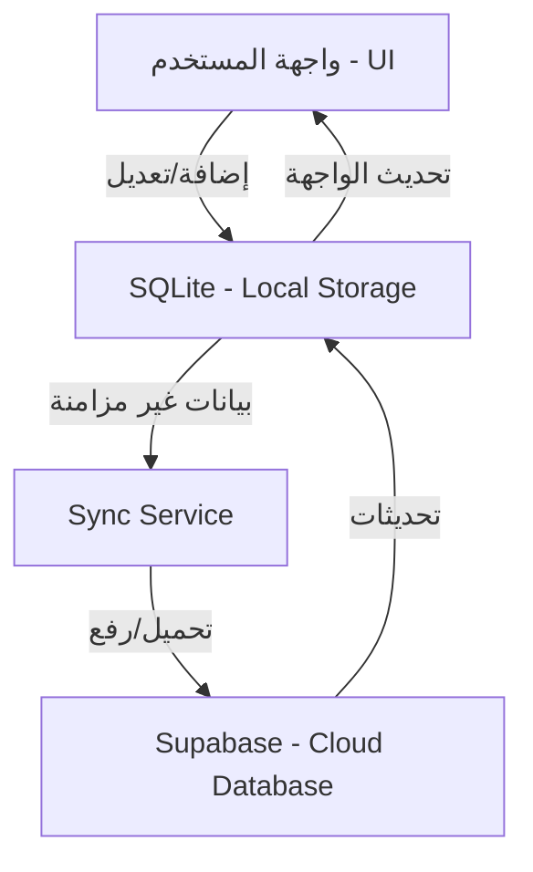

# Road of Dev - التوثيق الشامل للمشروع

هذا الملف يقدم نظرة شاملة وعميقة لمشروع **Balanceer** (Youth Budget Manager)، موضحاً التقنيات المستخدمة، هيكلية الملفات، الخدمات، ومسار التطوير.

---

## 🚀 نظرة عامة (Project Overview)
**Balanceer** هو تطبيق لإدارة الميزانية الشخصية مصمم للشباب. يهدف إلى مساعدة المستخدمين على تتبع نفقاتهم، وضع ميزانيات فئوية، والحصول على تحليلات بصرية لمصاريفهم. يتبع التطبيق استراتيجية **Offline-First**، مما يضمن تجربة سلسة حتى بدون اتصال بالإنترنت.

---

## 🛠️ التقنيات المستخدمة (Tech Stack)
- **Framework**: [Flutter](https://flutter.dev/) (Multi-platform UI toolkit).
- **Local Database**: [SQLite](https://pub.dev/packages/sqflite) (لتخزين البيانات محلياً).
- **Backend & Cloud**: [Supabase](https://supabase.com/) (للمزامنة، المصادقة، وتخزين البيانات سحابياً).
- **State Management**: إدارة الحالة المعتمدة على الـ Services (مع خطة مستقبلية للانتقال إلى Riverpod).
- **UI & Animation**: 
  - `Iconsax`: للأيقونات العصرية.
  - `Flutter Animate`: للتفاعلات البصرية السلسة.
  - `fl_chart`: للرسوم البيانية (Pie Chart & Bar Chart).
  - `Google Fonts`: لدعم الخطوط العربية بشكل احترافي.

---

## 🏗️ هيكلية المشروع (Project Architecture)
يتبع التطبيق نمطاً منظماً يعتمد على فصل المهام:

### 📁 هيكل المجلدات:
- `lib/models/`: تحتوي على نماذج البيانات (Expenses, Budgets, Users).
- `lib/services/`: القلب النابض للتطبيق، تتعامل مع قواعد البيانات والشبكات.
- `lib/screens/`: واجهات المستخدم المقسمة حسب الوظيفة (Home, Budget, Reports, Auth).
- `lib/widgets/`: المكونات القابلة لإعادة الاستخدام (Charts, Cards).
- `lib/config/`: الثوابت، ثيم التطبيق، وإعدادات Supabase.
- `lib/utils/`: الدوال المساعدة والثوابت العامة.

---

## ⚙️ الخدمات الأساسية (Core Services)

### 1. `LocalStorageService` (SQLite)
- المسؤول عن العمليات المحلية (CRUD).
- يضمن بقاء البيانات على جهاز المستخدم.
- يدعم جداول: `expenses`, `budgets`, `user_session`, `settings`.

### 2. `SupabaseService` (Cloud)
- الواجهة للتعامل مع قاعدة بيانات Supabase سحابياً.
- مسؤول عن رفع وتحميل البيانات عند توفر الاتصال.
- يدعم وظائف الـ Real-time (المزامنة الفورية).

### 3. `AuthService` (Authentication)
- يدعم تسجيل الدخول كـ (ضيف، بريد إلكتروني، Google).
- يدير عملية تحويل بيانات "الضيف" إلى حساب دائم عند التسجيل.

### 4. `SyncService` (Synchronization)
- الجسر بين SQLite و Supabase.
- يراقب حالة الاتصال بالإنترنت ويقوم بمزامنة البيانات غير المزامنة تلقائياً.
- يطبق منطق "الحفظ محلياً أولاً ثم المزامنة سحابياً".

---

## 📊 تدفق البيانات (Data Flow)

---

## 🛣️ مسار التطوير والميزات المضافة (Development Journey)

### ✅ ما تم إنجازه:
1.  **بناء الهيكل الأساسي**: إعداد SQLite و Supabase.
2.  **إدارة النفقات**: إضافة، عرض، وحذف النفقات.
3.  **إدارة الميزانية**: تحديد ميزانية لكل فئة ومقارنتها بالمصاريف.
4.  **التقارير البصرية**: رسوم بيانية دائرية وأعمدة لتحليل الاستهلاك.
5.  **تحسينات الأداء**: معالجة مشاكل الـ Charts مع القيم الضخمة.
6.  **تطوير واجهة التعديل**: إضافة إمكانية تعديل النفقات مباشرة من الشاشة الرئيسية.
7.  **توسيع القائمة (View All)**: تفعيل ميزة "عرض الكل/عرض أقل" بشكل ديناميكي في الصفحة الرئيسية.
8.  **حماية البيانات**: تقييد المدخلات وضمان عدم تكسر الواجهة مع الأرقام الكبيرة.

### 🚀 خطوات مستقبلية:
- [ ] الانتقال إلى **Riverpod** لإدارة حالة أكثر متانة.
- [ ] دعم تصدير التقارير بصيغة **PDF / Excel**.
- [ ] إضافة التنبيهات الذكية عند اقتراب تجاوز الميزانية.
- [ ] دعم لغات متعددة (Multilingual support).
- [ ] إضافة الوضع الليلي/النهاري بشكل تلقائي.

---

## 🛠️ دليل المطور (Developer Guide)
- **لإضافة ميزة جديدة**: ابدأ دائماً بتعديل الـ `Model` ثم الـ `Service` ثم الـ `UI`.
- **للمزامنة**: تأكد من أن الـ `is_synced` في SQLite يتم تحديثه عبر الـ `SyncService`.
- **للـ UI**: استخدم `AppTheme` لضمان تناسق التصميم (Glassmorphism effect).

---

*تم إعداد هذا الملف ليكون المرجع الأساسي لمسار تطوير تطبيق Balanceer.*
